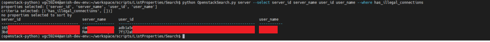

##### Search for hosts where host status is "enabled"
`python query_openstack.py host --select host_id host_name host_status memory_max memory_used vcpus_used vcpus_max --where status enabled`

##### Search for projects where description contains "heat"
`python query_openstack.py project --select project_id project_name project_description --where description_contains Heat
(note that args are case-sensitive)`

##### Search for project where name contains "rally"
`python query_openstack.py project --select project_id project_name project_description --where name_contains rally`

##### Search for servers with illegal outside connections
`python query_openstack.py server --select server_id server_name user_id user_name --where has_illegal_connections`

##### Search for servers on a specified host
`python query_openstack.py server --select server_id server_name server_status user_id user_name host_id host_name --where host_name hv2.nubes.rl.ac.uk`

##### Search for servers that are Errored or Shutoff
`python query_openstack.py server --select server_id server_name server_status --where status ERROR SHUTOFF`

(note - passing more than one argument within a --where param equivalent to OR)

##### Search for servers on a host that are shutoff
`python query_openstack.py server --select server_id server_name server_status --where status SHUTOFF --where host_id hv2.nubes.rl.ac.uk`

(note - having more than one --where equivalent to AND)

##### Search for servers older than 120 days
`python query_openstack.py server --select server_id server_name user_id user_name --where older_than 120`

##### Search for ips assigned to specific project
`python query_openstack.py ip --select ip_id ip_fixed_address ip_floating_address project_id project_name --where project_id 2ea35ef3303c4753b06f9a442754ab92 --sort-by ip_floating_address`

(note - can now have more than one sorting field)

##### Search for all users
`python query_openstack.py user --select user_id user_name user_email`

